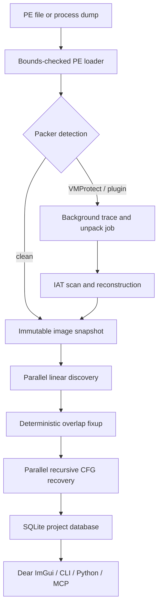

# AeroRE

A native Windows x86/x64 reverse-engineering workbench combining an
IDA-style analysis database with an x64dbg-style debugging workflow.

The current foundation is real C++20 code, not a UI mock: it parses PE32 and
PE32+ images, decodes with Zydis (with a built-in fallback), performs hybrid
parallel analysis, persists an IDA-like project in SQLite, debugs Windows
processes, reconstructs imports, exposes Python bindings, and serves the engine
over MCP.

## Pipeline



Workers only read immutable image bytes and produce local facts. One ordered
merge resolves overlaps, sorts cross-references, and commits a stable snapshot.
The UI consumes progress messages and never blocks on worker locks.

The detailed module map, threading boundaries, database model, and current
limitations are in [docs/architecture.md](docs/architecture.md).

## Build on Windows

Requirements: Visual Studio 2022, CMake 3.25+, Git, and vcpkg.

```powershell
git clone https://github.com/microsoft/vcpkg C:\src\vcpkg
C:\src\vcpkg\bootstrap-vcpkg.bat -disableMetrics
$env:VCPKG_ROOT = "C:\src\vcpkg"

cmake --preset windows-x64
cmake --build --preset windows-x64-release
ctest --preset windows-x64-release
```

The Windows preset enables the DirectX 11 Dear ImGui frontend and pybind11
module. To build only the engine and CLI:

```powershell
cmake --preset windows-x64 -DAERORE_BUILD_GUI=OFF -DAERORE_BUILD_PYTHON=OFF
```

For a custom preset that enables Python, also set the vcpkg manifest feature
`VCPKG_MANIFEST_FEATURES=python`; the provided Windows preset already does so.

## Commands

```text
aerore analyze <file> [-o project.idb] [--unpack]
aerore info <file>
aerore disasm <file> --va 0x140001000 [--count 40]
aerore fix-iat <file> --modules modules.json [--patch] [-o fixed.exe]
aerore unpack <file> [-o unpacked.exe]
aerore gui [file]
aerore mcp
aerore query <project.idb> <sql>
```

`modules.json` describes loaded module ranges and their exported virtual
addresses. IAT repair reverse-resolves raw pointers, follows common one-hop
trampolines, supports ordinal-only imports, emits a report, and can add a valid
`.aeroiat` import section while rewriting references.

## MCP

Run `aerore mcp` as a local stdio server. It speaks newline-delimited JSON-RPC
and supports the MCP initialize, ping, tools/list, and tools/call lifecycle.
Tools cover file loading, analysis, functions, disassembly, CFGs, xrefs,
sections, imports, exports, strings, byte reads, annotations, unpacking, IAT
repair, and read-only SQL queries.

Example client configuration:

```json
{
  "mcpServers": {
    "aerore": {
      "command": "C:/tools/AeroRE/aerore.exe",
      "args": ["mcp"]
    }
  }
}
```

## UI choice

Dear ImGui is the right first frontend for a solo developer: custom
disassembly/hex/graph panes and debugger state are faster to iterate, and the
engine stays toolkit-neutral. Qt becomes the better trade when accessibility,
internationalization, native document workflows, and a deep model/view layer
outweigh iteration speed.

## Status

| Area | Current state |
|---|---|
| PE loader | Sections, imports, exports, relocations, TLS, resources, Rich header, overlay |
| Decoder | Zydis primary, built-in x86/x64 fallback |
| Analysis | Parallel sweep, recursive descent, functions, CFGs, loops, xrefs, strings |
| Database | SQLite schema for analysis, names, comments, structs, types, plugin netnodes |
| Debugger | Windows create/attach, software/hardware/memory breakpoints, stepping, memory/register access |
| Unpacking | Plugin registry, VMProtect/Themida/Enigma detection, bounded stub tracing and OEP handoff |
| IAT fixer | Pointer scan, export reverse-resolution, trampoline handling, report and PE import rebuild |
| Automation | CLI, Python module, local MCP server |
| UI | Dear ImGui DirectX 11 shell and core analysis/debug panes |

The unpacker is intentionally described precisely: the current semantic tracer
handles bounded stubs and simple handoffs; it is not yet a general VMProtect
devirtualizer. See [docs/roadmap.md](docs/roadmap.md).

## Authorized use

Use AeroRE only with binaries and systems you own or are authorized to inspect.
It is intended for interoperability, defensive research, education, and
malware analysis.

## License

MIT

