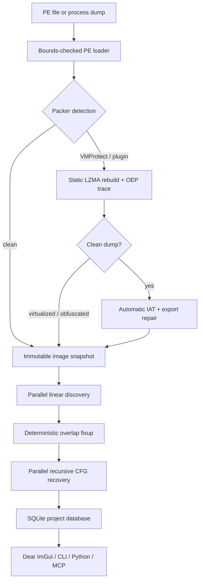

# AeroRE

A native Windows x86/x64 reverse-engineering workbench combining an
IDA-style analysis database with an x64dbg-style debugging workflow.

The current foundation is real C++20 code, not a UI mock: it parses PE32 and
PE32+ images, decodes with Zydis (with a built-in fallback), performs hybrid
parallel analysis, persists an IDA-like project in SQLite, debugs Windows
processes, reconstructs imports, exposes Python bindings, and serves the engine
over MCP.

## Pipeline



Workers only read immutable image bytes and produce local facts. One ordered
merge resolves overlaps, sorts cross-references, and commits a stable snapshot.
The UI consumes progress messages and never blocks on worker locks.

The detailed module map, threading boundaries, database model, and current
limitations are in [docs/architecture.md](docs/architecture.md).

## Build on Windows

Requirements: Visual Studio 2022, CMake 3.25+, Git, and vcpkg.

```powershell
git clone https://github.com/microsoft/vcpkg C:\src\vcpkg
C:\src\vcpkg\bootstrap-vcpkg.bat -disableMetrics
$env:VCPKG_ROOT = "C:\src\vcpkg"

cmake --preset windows-x64
cmake --build --preset windows-x64-release
ctest --preset windows-x64-release
```

The Windows preset enables the DirectX 11 Dear ImGui frontend and pybind11
module. To build only the engine and CLI:

```powershell
cmake --preset windows-x64 -DAERORE_BUILD_GUI=OFF -DAERORE_BUILD_PYTHON=OFF
```

For a custom preset that enables Python, also set the vcpkg manifest feature
`VCPKG_MANIFEST_FEATURES=python`; the provided Windows preset already does so.

Visual Studio users can open `AeroRE.sln` directly. The solution contains the
static core, the `aerore` executable, and native tests in Debug/Release for x86
and x64. Set `VCPKG_ROOT` or enable vcpkg's MSBuild integration before the first
build; the projects consume the repository manifest automatically.

## Commands

```text
aerore analyze <file> [-o project.idb] [--no-unpack]
aerore info <file>
aerore disasm <file> --va 0x140001000 [--count 40]
aerore fix-iat <file> --modules modules.json [--patch] [-o fixed.exe]
aerore unpack <file> [-o unpacked.exe]
aerore export-symbols <file> -o symbols.json [--no-unpack]
aerore gui [file]
aerore mcp
aerore query <project.idb> <sql>
```

`modules.json` describes loaded module ranges and their exported virtual
addresses. IAT repair reverse-resolves raw pointers, follows common one-hop
trampolines, supports ordinal-only imports, emits a report, and can add a valid
`.aeroiat` import section while rewriting references.

VMProtect loads first pass through a bounded static reconstruction stage. It
recognizes legacy and 3.9+ `PACKER_INFO` layouts, restores virtual-only sections
from raw LZMA blocks, and then runs the OEP tracer. A conservative post-unpack
classifier blocks all automatic PE table rewrites while virtualization or
obfuscation signals remain. Clean dumps automatically attempt IAT repair from
the attached process module snapshot and validate/rebuild preserved exports.

The GUI's **Export imports + exports JSON** button writes both tables to one
`aerore.symbols.v1` document. The same operation is available through the CLI
and MCP server.

## MCP

Run `aerore mcp` as a local stdio server. It speaks newline-delimited JSON-RPC
and supports the MCP initialize, ping, tools/list, and tools/call lifecycle.
Tools cover file loading, analysis, functions, disassembly, CFGs, xrefs,
sections, imports, exports, strings, byte reads, annotations, unpacking, IAT
and export repair, symbol JSON export, and read-only SQL queries. The GUI also
starts a loopback-only newline-delimited JSON-RPC endpoint (default
`127.0.0.1:37091`, override with `AERORE_MCP_PORT`) and shows the active port in
the Console / MCP pane.

Example client configuration:

```json
{
  "mcpServers": {
    "aerore": {
      "command": "C:/tools/AeroRE/aerore.exe",
      "args": ["mcp"]
    }
  }
}
```

## UI choice

The Dear ImGui frontend uses an IDA-inspired dockable workbench without copying
IDA's layout or branding. It includes a searchable `sub_...` function list,
address/bytes/instruction listing, deterministic pseudocode preview, hex and
CFG panes, strings, xrefs, imports/exports, registers, stack, and an auditable
console with the MCP endpoint and analysis/debugger events. The pseudocode pane
is deliberately conservative CFG lifting, not a claim of full decompilation.

The debugger includes an independently toggled user-mode anti-anti-debug layer:
PEB and heap normalization, per-module IAT hooks for Win32/NT debug queries,
thread-hide interception, optional real thread hiding, optional DR0–DR7
hygiene, and OutputDebugString/invalid-handle exception neutralization. See
[docs/anti-anti-debug.md](docs/anti-anti-debug.md) for defaults, audit notes,
and limitations.

## Status

| Area | Current state |
|---|---|
| PE loader | Sections, imports, exports, relocations, TLS, resources, Rich header, overlay |
| Decoder | Zydis primary, built-in x86/x64 fallback |
| Analysis | Parallel sweep, recursive descent, functions, CFGs, loops, xrefs, strings |
| Database | SQLite schema for analysis, names, comments, structs, types, plugin netnodes |
| Debugger | Windows x86/x64 create/attach, breakpoints, stepping, memory/register access, configurable anti-anti-debug |
| Unpacking | VMProtect static LZMA reconstruction, plugin detection, bounded semantic trace and OEP handoff |
| PE repair | Safety-gated automatic IAT and export reconstruction, plus manual actions and JSON interchange |
| Automation | CLI, Python module, local MCP server |
| UI | IDA-inspired dockable Dear ImGui workbench with disassembly, pseudocode, hex, CFG, symbols, debugger and MCP console |

The unpacker is intentionally described precisely: the current semantic tracer
handles bounded stubs and simple handoffs; it is not yet a general VMProtect
devirtualizer. See [docs/roadmap.md](docs/roadmap.md).

## Authorized use

Use AeroRE only with binaries and systems you own or are authorized to inspect.
It is intended for interoperability, defensive research, education, and
malware analysis.

## License

MIT

