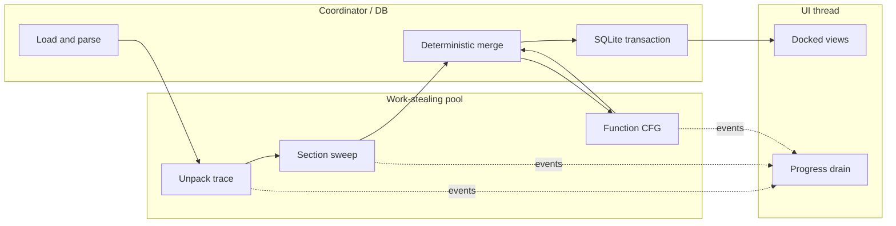

# AeroRE architecture

## Design rule

Parallel work discovers facts; it never mutates canonical program state.
Workers receive immutable PE bytes and return instructions, candidate
functions, CFG edges, strings, and xrefs. A single deterministic fixup phase
sorts and resolves those facts before SQLite or the UI can observe them.

## Modules

| Module | Responsibility | Boundary |
|---|---|---|
| `pe` | PE32/PE32+ parsing, RVA mapping, rebuilds, added sections | Immutable after load except explicit rebuild operations |
| `decoder` | Zydis adapter plus dependency-free fallback decoder | One decoder per analysis context |
| `engine` | Linear sweep, function seeds, recursive descent, CFGs, loops, xrefs, strings | Worker-local output, ordered merge |
| `pool` | Per-worker queues with work stealing | Jobs do not own global analysis state |
| `model` | Stable program snapshot and bidirectional lookup | Published atomically through `Session` |
| `database` | SQLite IDB, schema migration, annotations, netnodes, read-only query gate | Serialized commit after analysis |
| `debugger` | Windows debug loop, breakpoints, registers, memory and module snapshots | Nonblocking event pump after the initial attach stop |
| `anti_debug` | Reversible PEB/heap/IAT concealment and exception filtering | Attach/module/thread/continue lifecycle |
| `emu` | Bounded concrete execution for straight-line protector stubs | No host execution of target code |
| `unpack` | `IUnpacker` registry, scoring, trace/OEP handoff | Returns rebuilt bytes and provenance |
| `iat` | Export reverse-map, trampoline resolution, import report/rebuild | Works on image/module snapshots |
| `exports` | Export directory validation/rebuild from preserved symbols | Runs only behind the post-unpack safety gate |
| `session` | Orchestration and snapshot lifetime | API used by UI, CLI, Python, MCP |
| `mcp` | Local JSON-RPC tool facade | Stdio plus GUI-owned loopback-only TCP listener |
| `ui` | Dear ImGui docking frontend | Consumes snapshots and progress events |

## Data flow and threads

The loader/coordinator owns the mutable `PeImage`. Analysis workers receive
only const references. Section sweep jobs run first. Their decoded candidates
are sorted by address and overlap conflicts are resolved deterministically.
Entry point, exports, TLS callbacks, direct call targets, and prologue matches
form the function seed set. Function jobs then recurse over the canonical
instruction map. Results are sorted again before a `ProgramModel` snapshot is
published.

The debugger holds the initial attach event so concealment can be installed
before target code continues. After that stop, resume/step operations return
immediately and the UI drives a zero-timeout Win32 event pump once per frame.
Live memory and module lists become explicit snapshots before they enter
analysis or IAT reconstruction, and workers never call rendering APIs.

The optional anti-anti-debug layer is documented in
[anti-anti-debug.md](anti-anti-debug.md). Its defaults patch reversible PEB,
heap, and imported API observations while leaving irreversible thread hiding
and DR-register sanitization off until explicitly enabled.

The TCP listener performs socket I/O on its worker, then queues each request
back to the UI thread before touching `Session`. This prevents MCP mutations
from racing the PE image, SQLite handle, or live views.

## Analysis invariants

- Persisted addresses are virtual addresses; PE directory fields remain RVAs.
- Every PE read is bounds checked against the owned file/mapped image.
- Canonical instruction ranges never overlap.
- Given the same bytes and settings, output ordering is independent of worker
  count.
- Direct calls add function seeds and bidirectional call xrefs.
- Conditional branches add taken and fall-through CFG edges.
- Backward CFG edges are retained as loop candidates.
- User names, comments, and types are logically separate from derived facts.

## SQLite IDB

The database stores segments, instructions, functions, basic blocks, edges,
loops, xrefs, strings, imports, exports, names, comments, structures, applied
types, reconstructed IAT entries, metadata, and plugin `netnode` blobs. WAL
mode and foreign keys are enabled. Schema changes run transactionally.

`query_json` accepts one read-only `SELECT`, `WITH`, `PRAGMA`, or `EXPLAIN`
statement and rejects mutation, which is the surface exposed through MCP.

## Unpacker boundary

`IUnpacker` has three jobs: score an image, run with progress reporting, and
return an `UnpackResult` containing rebuilt bytes, OEP, confidence, log, and
lifted effects. Packer-specific logic stays outside the PE loader and analyzer.

The VMProtect plugin first reconstructs virtual-only sections from bounded raw
LZMA blocks. It supports both legacy plaintext `PACKER_INFO` entries and the
3.9+ destination-XOR table whose key rotates left seven bits per entry. The
rebuilt virtual image is then passed to the bounded tracer. It interprets a useful subset of
x86/x64 arithmetic, memory, stack, and control flow, recognizes a handoff from
a protector section to a clean executable section, patches the OEP, and feeds
the new image back through normal analysis. General VM handler discovery and
devirtualization require the micro-IR milestone described in the roadmap.

After reconstruction, entry-section entropy, remaining virtual-only sections,
decode validity, VM-style arithmetic density, and indirect control-flow density
produce separate virtualization and obfuscation scores. Automatic IAT and
export rewriting is allowed only when both scores pass the conservative gate.
Blocked images remain analyzable and the reasons are exposed to the UI, CLI,
and MCP logs.

## IAT reconstruction

The fixer scans pointer-sized slots in non-executable sections. Values are
matched against module ranges and exact export VAs. If a pointer targets the
image, up to four direct/indirect trampoline steps are followed. Named and
ordinal imports are grouped per DLL, then a new import descriptor, ILT, IAT,
hint/name data, and DLL strings are emitted into `.aeroiat`. RIP-relative and
embedded absolute references to old slots are rewritten.

## UI boundary

Dear ImGui owns rendering only. All panes operate on `ProgramModel`, `PeImage`,
`Debugger`, and command methods on `Session`. No ImGui type appears in a public
engine header, preserving a clean migration path to Qt.

